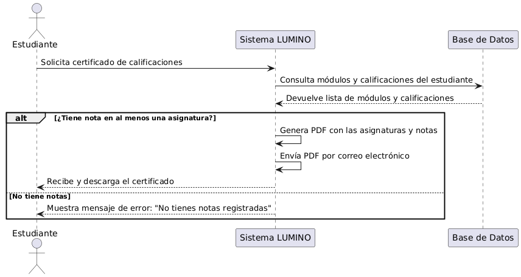
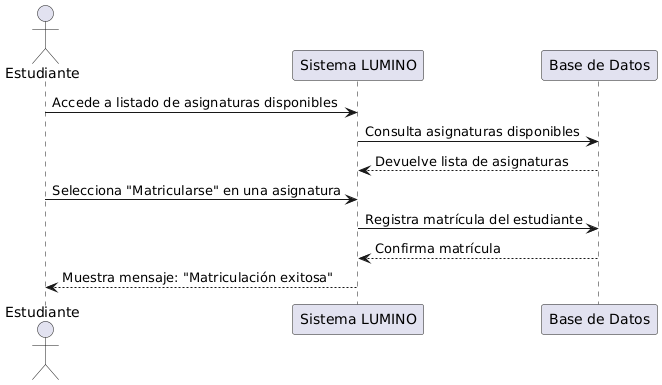
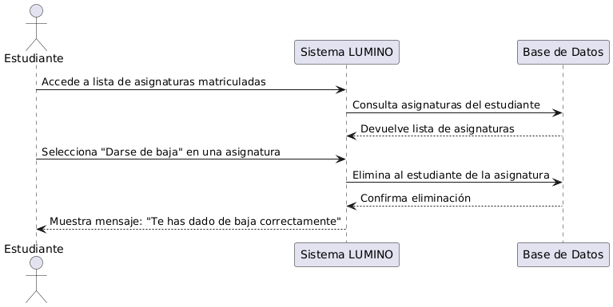
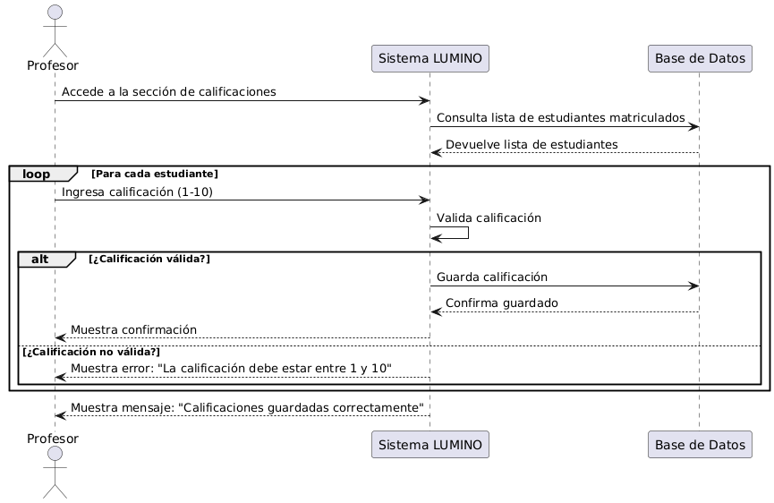
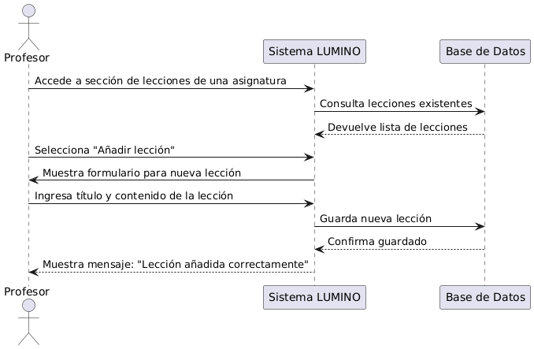
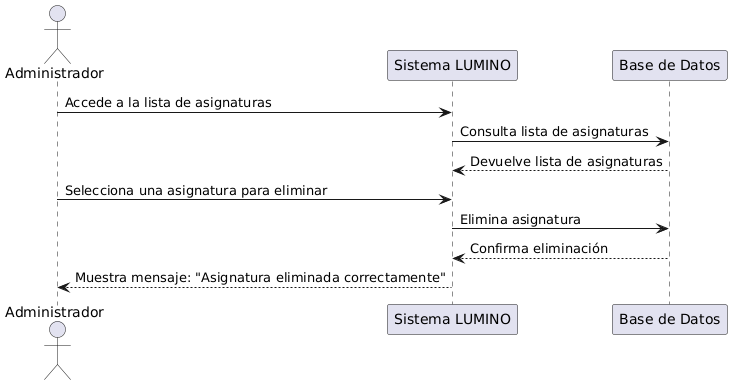
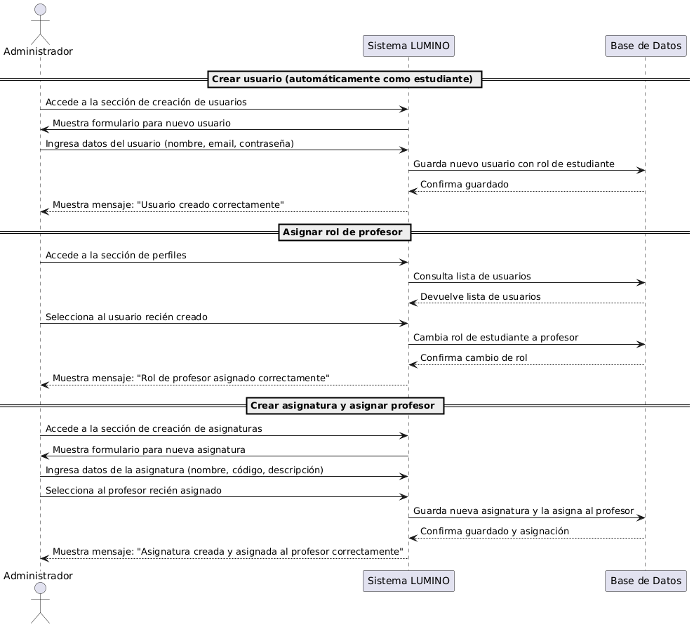

# Requisitos del proyecto

## 1. Requisitos funcionales

LUMINO debe proporcionar funcionalidades que satisfagan las necesidades de profesores, estudiantes y administradores, facilitando la gestión académica a través de una interfaz intuitiva basada en Django. Las funcionalidades principales son:

### Autenticación y gestión de usuarios:

- Los usuarios podrán registrarse como estudiantes e iniciar sesión con credenciales válidas.
- Los administradores gestionarán y crearán perfiles de profesorado.
- Cada usuario tendrá un perfil automáticamente generado con un rol (estudiante o profesor) visible en su perfil.

### Asignaturas, lecciones y calificaciones:

- Los profesores podrán crear, editar y eliminar lecciones de las asignaturas que imparten.
- Los estudiantes podrán matricularse o desmatricularse de asignaturas.
- Los profesores calificarán a los estudiantes inscritos en sus asignaturas, asignando notas del 1 al 10. Las notas iguales o superiores a 5 se mostrarán en verde, y las inferiores en rojo.

### Interacción con los contenidos:

- Los estudiantes accederán a las lecciones de los módulos en los que estén matriculados. Si tienen una calificación en la asignatura, esta se mostrará en un mensaje encima de las lecciones.
- Los profesores podrán crear, editar y eliminar lecciones dentro de las asignaturas que gestionen.

### Generación de certificados:

- Los estudiantes podrán solicitar certificados de calificaciones, que incluirán todas las asignaturas en las que estén inscritos y tengan una nota.
- El certificado se generará automáticamente en formato PDF y se enviará por correo electrónico al usuario.

### Administración:

- LUMINO incluirá una interfaz administrativa basada en Django para gestionar los modelos principales: asignaturas, lecciones, matriculaciones y perfiles.
- Los administradores podrán asignar roles (profesor o estudiante) a los usuarios y crear asignaturas con su descripción, asignándolas a un profesor.

### Internacionalización:

- LUMINO permitirá cambiar el idioma de la interfaz entre español e inglés mediante un switch en el navegador.

### Modo claro y modo oscuro:

- El sistema ofrecerá dos opciones de interfaz: modo claro (predeterminado) y modo oscuro (para reducir la fatiga visual). Los usuarios podrán alternar entre ambos con un solo clic en un icono de la barra lateral.

### Personalización:

- Los usuarios pueden modificar su biografía y subir una imagen de perfil.

---

## 2. Requisitos no funcionales

### Rendimiento:

- Las consultas a la base de datos relacionadas con matrículas y calificaciones se han optimizado mediante querysets eficientes, recuperando solo los datos necesarios para reducir la sobrecarga. Esto garantiza tiempos de respuesta rápidos incluso con un alto volumen de datos.

### Escalabilidad:

- El diseño modular del sistema (estructurado en aplicaciones independientes) permite añadir nuevas funcionalidades sin afectar las existentes, asegurando flexibilidad en el desarrollo. Además, la arquitectura soporta escalabilidad horizontal en caso de aumento de usuarios.

### Seguridad:

- **Autenticación segura**: Se utiliza el sistema de autenticación incorporado de Django, con hashing de contraseñas y control de acceso basado en roles (administrador, profesor y estudiante).
- **Protección de datos**: Los datos sensibles se almacenan cifrados en la base de datos, y el acceso a funcionalidades críticas se restringe mediante decoradores de autorización (`@login_required`, `@permission_required`).

### Usabilidad:

- **Flujo simplificado**: Las tareas comunes, como inscribirse en una asignatura o generar certificados, requieren un número mínimo de pasos y están guiadas por una navegación intuitiva.
- **Diseño responsive**: La plataforma se adapta a diferentes dispositivos y tamaños de pantalla gracias a la integración de Bootstrap.
- **Retroalimentación visual**: Se utilizan mensajes flash de Django y animaciones discretas para informar a los usuarios sobre el éxito, error o advertencia de sus acciones.

---

## 3. Restricciones

### Técnicas:

- El proyecto se desarrolló utilizando Django como framework principal, siguiendo las buenas prácticas recomendadas en la asignatura DSW y los requisitos especificados en el PDF proporcionado por el profesor Sergio Delgado Quintero.
- La base de datos utilizada fue SQLite, adecuada para el desarrollo de un proyecto de este tamaño. En un entorno más robusto o profesional podría evaluarse el uso de PostgreSQL u otro sistema.
- Las funcionalidades como la generación de certificados en PDF y el envío de correos electrónicos se implementaron utilizando la biblioteca de Django llamada DJANGO-RQ, pero priorizando la simplicidad.

### Recursos:

- El desarrollo estuvo limitado por el plazo de entrega establecido por el profesor, con una fecha límite del 17 de enero de 2025.
- El equipo de desarrollo estuvo conformado por dos personas, lo cual restringió la capacidad de incluir funcionalidades adicionales.

### Legales (hipotéticas):

- En un entorno real, sería necesario cumplir con regulaciones de protección de datos, como el RGPD, para garantizar la privacidad y seguridad de la información de los usuarios.
- Los certificados generados podrían ajustarse para cumplir con estándares de validez y autenticidad en un entorno profesional.

### De negocio (hipotéticas):

- En un contexto real, se podría plantear como una plataforma gratuita para los usuarios, lo que implicaría la necesidad de asegurar sostenibilidad financiera para mantenimiento y escalabilidad.
- El proyecto sería de código abierto, lo que implica que la implementación debe ser clara y estar bien documentada para facilitar contribuciones externas.

---

## 4. Casos de Uso

### 4.1 Estudiantes

### Solicitar un certificado de calificaciones

Un estudiante solicita un certificado que incluya las calificaciones de todas las asignaturas en las que está matriculado que tengan nota. El sistema genera un PDF y lo envía por correo electrónico.

### Matricularse en una asignatura

Un estudiante se inscribe en una asignatura disponible en la plataforma. El sistema registra la matrícula y actualiza su perfil.

### Darse de baja de una asignatura

Un estudiante abandona una asignatura en la que estaba matriculado. El sistema elimina su matrícula y actualiza su perfil.

## 

### 4.2 Profesores

### Registrar las calificaciones de un curso

Un profesor ingresa las calificaciones de los estudiantes matriculados en una asignatura que imparte. El sistema guarda las calificaciones y las muestra en los perfiles de los estudiantes.

### Añadir una lección

Un profesor crea una nueva lección para una asignatura que imparte. El sistema guarda la lección y la hace disponible para los estudiantes matriculados.

### Eliminar una lección

Un profesor elimina una lección de una asignatura que imparte. El sistema actualiza la lista de contenidos de la asignatura.

---

### 4.3 Administradores

### Crear usuario, asignar rol de profesor, crear asignatura y asignar profesor

Un administrador crea un nuevo usuario, le asigna el rol de profesor, crea una nueva asignatura y la asigna al profesor recién creado. El sistema gestiona todos estos pasos de manera integrada.

---
