# :fontawesome-solid-person-digging: Diseño

## 1. Arquitectura del Sistema

LUMINO sigue una arquitectura **Modelo-Vista-Template (MVT)**, propia de Django, organizada en tres capas principales:

### Modelo (Model):

- Se encarga de la estructura de datos y la interacción con la base de datos.
- En LUMINO, los modelos definen entidades como `Subject`, `Lesson`, `Enrollment` y `Profile`.
- Durante el desarrollo, se utiliza **SQLite** como base de datos, con la posibilidad de migrar a sistemas más robustos como **PostgreSQL** o **MySQL** en producción.
- El **ORM (Object-Relational Mapping)** de Django facilita las operaciones de base de datos sin necesidad de escribir consultas SQL manualmente.

### Vista (View):

- Contiene la lógica de negocio y procesa las solicitudes del usuario.
- En LUMINO, las vistas manejan acciones como:
  - La matriculación de estudiantes.
  - La creación y gestión de lecciones por parte de los profesores.
  - La visualización de calificaciones y certificados.
- Las vistas se encargan de devolver respuestas, ya sea renderizando plantillas HTML o devolviendo datos en formato JSON para APIs.

### Plantilla (Template):

- Define la presentación de la aplicación, generando **HTML dinámico** para la interfaz web.
- En LUMINO, los templates muestran información como:
  - Listas de módulos y lecciones.
  - Perfiles de usuario.
  - Calificaciones y certificados.
- Se utiliza **Bootstrap** para garantizar un diseño moderno y responsivo.
- Siguiendo las buenas prácticas, los estilos **CSS** y los scripts **JavaScript** se gestionan en archivos independientes, que luego se vinculan a los templates. Esto mejora la mantenibilidad y la organización del código.

## 2. **Modelo de Datos**

El proyecto **LUMINO** utiliza un esquema de base de datos relacional compuesto por varias tablas principales, cada una con sus atributos y relaciones. A continuación, se describen las entidades más importantes:

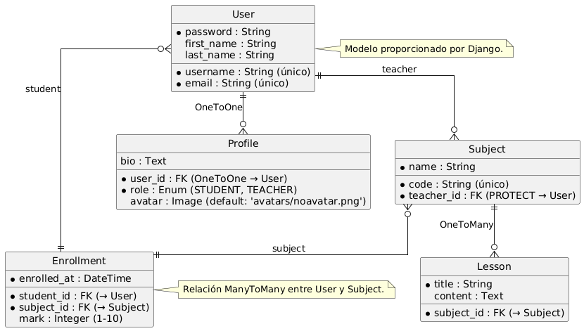

#### **1. Tabla `Subject` (Asignatura)**

- **Atributos**:
  - `code`: Código único de la asignatura (cadena de texto, único).
  - `name`: Nombre de la asignatura (cadena de texto).
  - `teacher`: Profesor que imparte la asignatura (clave foránea a `User`, con protección en la eliminación).
- **Relaciones**:
  - Relación **ManyToMany** con la tabla `User` a través de la tabla `Enrollment` para representar los estudiantes matriculados.

#### **2. Tabla `Lesson` (Lección)**

- **Atributos**:
  - `title`: Título de la lección (cadena de texto).
  - `content`: Contenido de la lección (texto largo, opcional).
- **Relaciones**:
  - Relación **ForeignKey** con la tabla `Subject` para indicar a qué asignatura pertenece la lección.

#### **3. Tabla `Enrollment` (Matrícula)**

- **Atributos**:
  - `student`: Estudiante matriculado (clave foránea a `User`).
  - `subject`: Asignatura en la que está matriculado (clave foránea a `Subject`).
  - `enrolled_at`: Fecha de matriculación (fecha y hora, automática al crear el registro).
  - `mark`: Calificación del estudiante en la asignatura (entero, opcional, con validadores de mínimo 1 y máximo 10).
- **Relaciones**:
  - Relación **ManyToMany** entre `User` y `Subject` a través de esta tabla.

#### **4. Tabla `Profile` (Perfil de Usuario)**

- **Atributos**:
  - `user`: Relación **OneToOne** con la tabla `User` (usuario asociado al perfil).
  - `role`: Rol del usuario (enumeración: `STUDENT` o `TEACHER`, con valor por defecto `STUDENT`).
  - `avatar`: Foto de perfil del usuario (imagen, opcional, con valor por defecto `avatars/noavatar.png`).
  - `bio`: Biografía del usuario (texto largo, opcional).
- **Relaciones**:
  - Relación **OneToOne** con la tabla `User`.

#### **5. Tabla `User` (Usuario)**

- **Nota**: No es necesario implementar este modelo, ya que se utiliza el modelo `User` proporcionado por Django.
- **Atributos** (incluidos en el modelo de Django):
  - `username`: Nombre de usuario único.
  - `email`: Correo electrónico.
  - `password`: Contraseña cifrada.
  - Otros campos estándar como `first_name`, `last_name`, etc.

---

### **Relaciones entre Entidades**

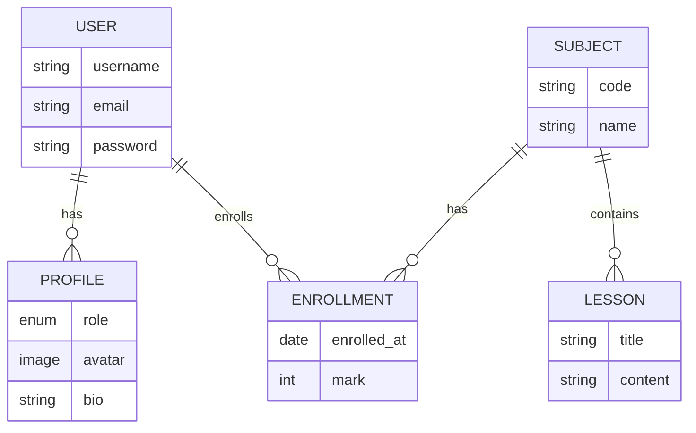

<ol>
  <li><strong>Profesor y Asignatura (<code>Subject</code>):</strong>
    <ul>
      <li>Un profesor puede impartir varias asignaturas.</li>
      <li>Una asignatura es impartida por un único profesor (relación <strong>ForeignKey</strong>).</li>
    </ul>
  </li>
  <li><strong>Estudiante y Asignatura (<code>Enrollment</code>):</strong>
    <ul>
      <li>Un estudiante puede estar matriculado en varias asignaturas.</li>
      <li>Una asignatura puede tener varios estudiantes matriculados (relación <strong>ManyToMany</strong> a través de <code>Enrollment</code>).</li>
    </ul>
  </li>
  <li><strong>Lección y Asignatura (<code>Lesson</code>):</strong>
    <ul>
      <li>Una lección pertenece a una única asignatura.</li>
      <li>Una asignatura puede tener varias lecciones (relación <strong>ForeignKey</strong>).</li>
    </ul>
  </li>
  <li><strong>Usuario y Perfil (<code>Profile</code>):</strong>
    <ul>
      <li>Cada usuario tiene un único perfil.</li>
      <li>El perfil contiene información adicional como el rol, la biografía y la foto de perfil (relación <strong>OneToOne</strong>).</li>
    </ul>
  </li>
</ol>

---

## 3. Diagramas

### **Diagrama de Clase**

Muestra los modelos y sus relaciones.

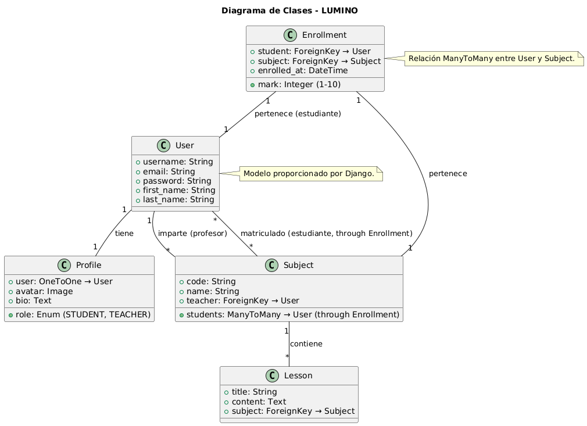

---

### **Diagrama proporcionado por el profesor**

Este diagrama, incluido en el PDF informativo, describe los modelos y relaciones necesarios para la implementación del proyecto.

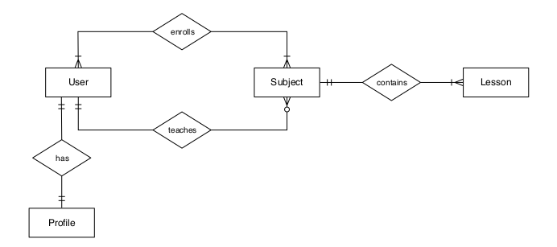

---

### **Diagrama de Actividades**

Muestra las interacciones de un usuario con la interfaz de LUMINO, detallando el flujo de acciones desde el registro hasta las funcionalidades específicas.

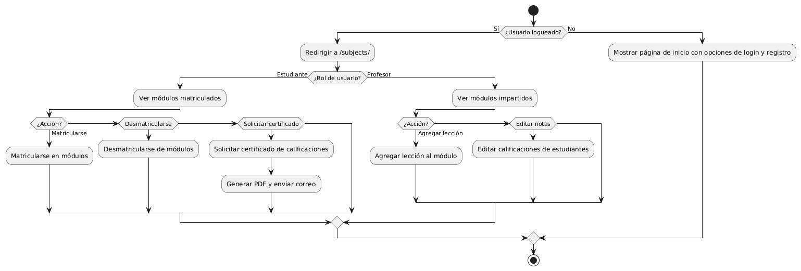

---

## 4. Decisiones de Diseño

Django fue seleccionado como framework principal debido a su robustez y capacidad para escalar, lo que lo hace adecuado tanto para proyectos sencillos como para aplicaciones más complejas, como la gestión académica. Su arquitectura MVT garantiza una separación clara de responsabilidades, simplificando el mantenimiento del código. Para el entorno de desarrollo, se utilizó SQLite por su facilidad de uso, dejando abierta la posibilidad de migrar a PostgreSQL en producción para soportar mayores requerimientos de escalabilidad.

#### Diseño Visual

El diseño de Lumino sigue un enfoque minimalista y funcional, pensado para brindar una experiencia amigable y visualmente agradable tanto a estudiantes como profesores. Se destacan los siguientes elementos:

<ol>
  <li><strong>Paleta de colores:</strong>
    <ul>
      <li>El sistema utiliza tonos pastel, con el verde claro como color predominante en el fondo, transmitiendo calma y modernidad. Para los elementos interactivos, como botones, se emplea un verde oscuro que crea un contraste claro y enfocado.</li>
      <li>En el <strong>modo oscuro</strong>, se invierte la estética, utilizando un fondo casi negro con detalles en verde y texto en colores claros, asegurando una experiencia cómoda para los usuarios en ambientes con poca luz.</li>
    </ul>
  </li>
  <li><strong>Tipografía:</strong>
    <ul>
      <li>La elección de una tipografía sans-serif limpia garantiza la legibilidad y refuerza el estilo moderno de la plataforma.</li>
    </ul>
  </li>
  <li><strong>Diseño visual:</strong>
    <ul>
      <li>En la página de inicio, una ilustración personalizada del personaje Lumino, un mago del conocimiento, da un toque de personalidad al sistema, haciendo que la primera impresión sea más acogedora y memorable.</li>
      <li>Las tarjetas utilizadas para mostrar los módulos están organizadas de forma clara, resaltando la información más relevante (nombre del módulo, profesor, número de estudiantes y lecciones).</li>
    </ul>
  </li>
  <li><strong>Estructura y navegación:</strong>
    <ul>
      <li>La barra lateral izquierda proporciona una navegación simple y constante, con iconos e ítems bien distribuidos.</li>
      <li>Los botones principales como "Iniciar sesión" y "Regístrate" son visibles y accesibles, cumpliendo con principios básicos de diseño centrado en el usuario.</li>
    </ul>
  </li>
  <li><strong>Accesibilidad y usabilidad:</strong>
    <ul>
      <li>El diseño asegura una navegación intuitiva con un flujo claro y ordenado.</li>
      <li>La inclusión de un selector de idiomas (español e inglés) en la esquina superior derecha facilita su uso en contextos multiculturales.</li>
      <li>El contraste en el <strong>modo oscuro</strong> y el uso de colores resaltantes mejora la accesibilidad, haciéndolo apto para usuarios con necesidades visuales específicas.</li>
    </ul>
  </li>
</ol>

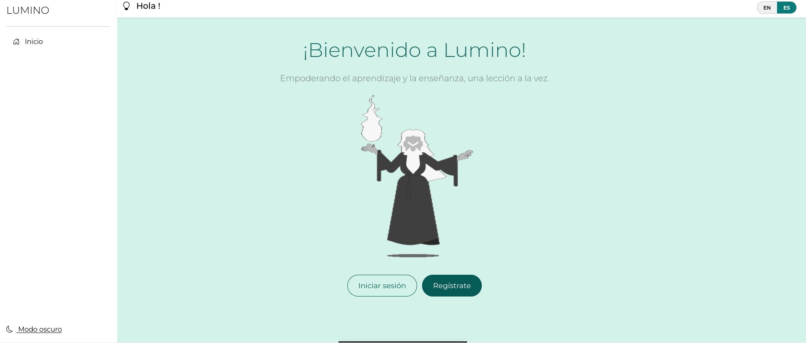
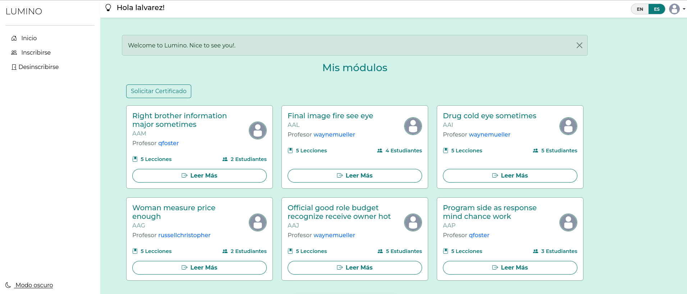
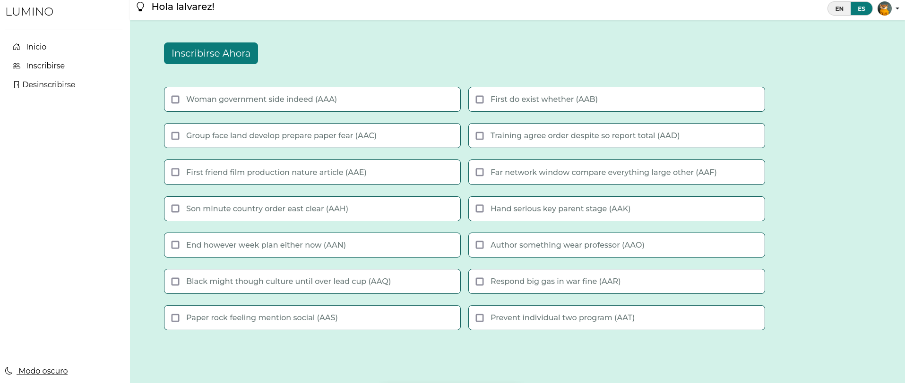
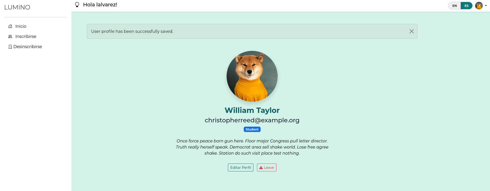
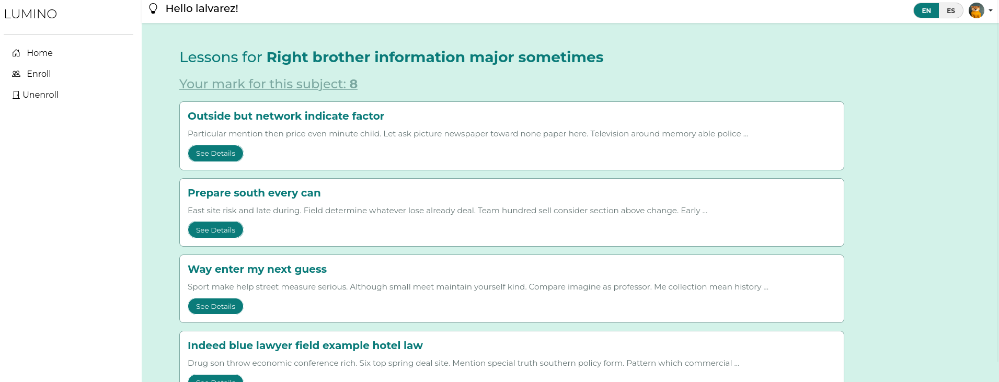
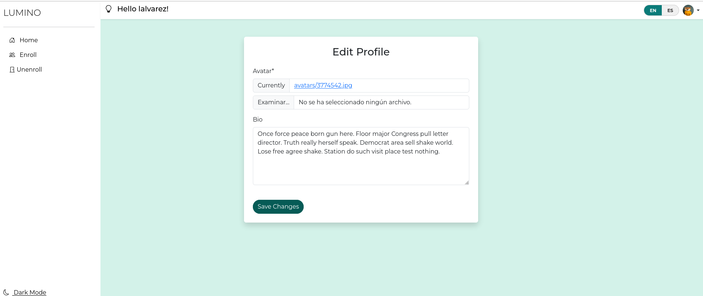
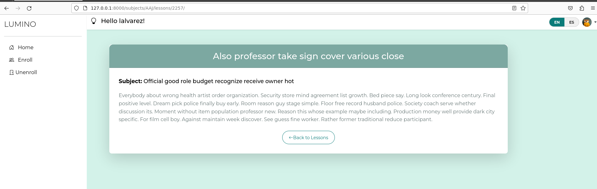
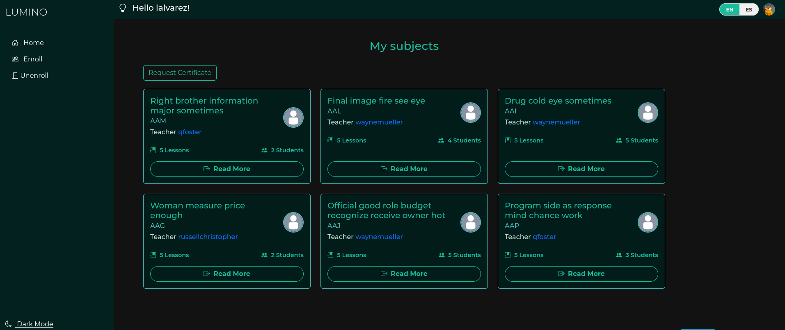
