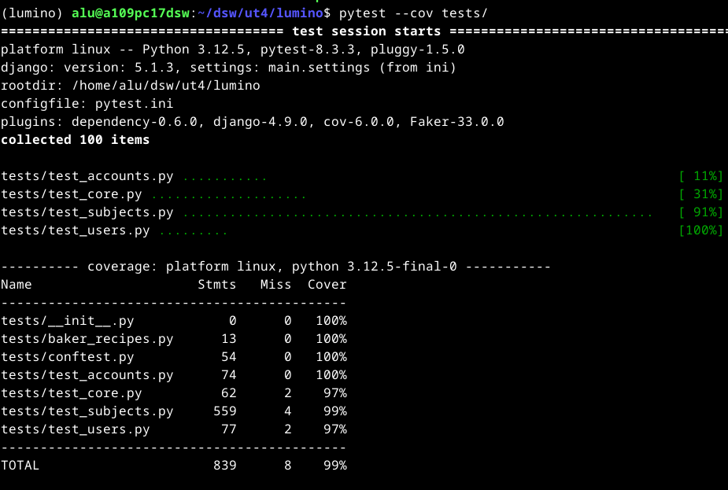

# :material-test-tube: Pruebas

### 1. **Estrategia de Pruebas**

#### Métodos utilizados (unitarias, de integración, de aceptación)

En LUMINO, se implementó una estrategia de pruebas basada en los **100 tests proporcionados por el profesor**, los cuales cubren una amplia gama de funcionalidades y casos de uso. Estos tests se dividen en:

<ol>
  <li><strong>Pruebas unitarias</strong>:
    <ul>
      <li>Verifican el funcionamiento de componentes individuales, como modelos, vistas y formularios.</li>
      <li><strong>Ejemplo</strong>: Comprobar que los campos de los modelos (<code>Subject</code>, <code>Lesson</code>, <code>Enrollment</code>, etc.) están correctamente definidos.</li>
    </ul>
  </li>
  <li><strong>Pruebas de integración</strong>:
    <ul>
      <li>Validan la interacción entre diferentes componentes del sistema.</li>
      <li><strong>Ejemplo</strong>: Verificar que un estudiante puede matricularse en una asignatura y que esta acción se refleja correctamente en la base de datos.</li>
    </ul>
  </li>
  <li><strong>Pruebas de aceptación</strong>:
    <ul>
      <li>Garantizan que las funcionalidades cumplen con los requisitos del usuario final.</li>
      <li><strong>Ejemplo</strong>: Comprobar que un profesor puede crear una lección y que esta se muestra correctamente en la interfaz.</li>
    </ul>
  </li>
</ol>

Los tests están organizados en la carpeta `tests/`, con archivos separados por funcionalidades:

- `test_accounts.py`: Pruebas relacionadas con la autenticación y gestión de usuarios.
- `test_subjects.py`: Pruebas relacionadas con asignaturas, lecciones y matriculaciones.
- `test_users.py`: Pruebas relacionadas con perfiles de usuario y roles.
- `test_core.py`: Pruebas generales del sistema, como la instalación de aplicaciones y la configuración de modelos.

---

### 2. **Casos de Prueba**

#### Ejemplos específicos y sus resultados esperados

A continuación, se describen algunos casos de prueba clave y sus resultados esperados:

<ol>
  <li><strong>Creación de usuarios</strong>:
    <ul>
      <li><strong>Caso</strong>: Un administrador añade un nuevo usuario desde la interfaz administrativa y le asigna el rol de profesor manualmente.</li>
      <li><strong>Resultado esperado</strong>: El usuario se crea correctamente y puede iniciar sesión.</li>
    </ul>
  </li>
  <li><strong>Generación de certificados</strong>:
    <ul>
      <li><strong>Caso</strong>: Un estudiante solicita un certificado de calificaciones.</li>
      <li><strong>Resultado esperado</strong>: Se genera un certificado en formato PDF con las calificaciones del estudiante.</li>
    </ul>
  </li>
  <li><strong>Control de acceso</strong>:
    <ul>
      <li><strong>Caso</strong>: Un profesor intenta solicitar un certificado.</li>
      <li><strong>Resultado esperado</strong>: Aparece un mensaje de error "Forbidden".</li>
    </ul>
  </li>
  <li><strong>Matriculación y desmatriculación</strong>:
    <ul>
      <li><strong>Caso</strong>: Un estudiante intenta matricularse en una asignatura.</li>
      <li><strong>Resultado esperado</strong>: La matriculación se realiza correctamente y se muestra un mensaje de confirmación.</li>
    </ul>
  </li>
  <li><strong>Validación de credenciales</strong>:
    <ul>
      <li><strong>Caso</strong>: Un usuario intenta iniciar sesión con credenciales incorrectas.</li>
      <li><strong>Resultado esperado</strong>: Aparece un mensaje de error indicando que las credenciales son inválidas.</li>
    </ul>
  </li>
  <li><strong>Internacionalización</strong>:
    <ul>
      <li><strong>Caso</strong>: Un usuario hace clic en el switch para cambiar de idioma.</li>
      <li><strong>Resultado esperado</strong>: El texto de la interfaz cambia al idioma seleccionado (español o inglés).</li>
    </ul>
  </li>
  <li><strong>Modo claro/oscuro</strong>:
    <ul>
      <li><strong>Caso</strong>: Un usuario hace clic en el icono para cambiar al modo oscuro.</li>
      <li><strong>Resultado esperado</strong>: La interfaz cambia a un esquema de colores oscuros.</li>
    </ul>
  </li>
</ol>

---

### 3. **Cobertura de Pruebas**

#### Indicadores de qué partes del código están siendo probadas

Para medir la cobertura de las pruebas, se utilizó **pytest** junto con **coverage.py**, lo que permitió verificar que el 99% del código está cubierto por los tests. Esto incluye:

- **Modelos**: Todos los campos y relaciones de los modelos (`Subject`, `Lesson`, `Enrollment`, `Profile`, etc.) están validados.
- **Vistas**: Se comprobó que las vistas manejan correctamente las solicitudes y devuelven las respuestas esperadas.
- **Formularios**: Se verificó que los formularios validan correctamente los datos ingresados por los usuarios.
- **Templates**: Se aseguró que las plantillas muestran la información correcta y manejan adecuadamente los errores.

---

### 4. **Automatización**

#### Herramientas y scripts utilizados para pruebas automáticas

En LUMINO, se utilizó **pytest** como framework principal para la automatización de pruebas. Los tests proporcionados por el profesor cubren una amplia gama de funcionalidades y se ejecutan automáticamente en cada cambio del código para garantizar la estabilidad del sistema.

Además, se implementaron scripts personalizados para:

- **Carga de datos de prueba**: Utilizando **Model-Bakery**, se generaron datos de prueba realistas para validar el comportamiento del sistema en diferentes escenarios.
- **Ejecución de tareas en segundo plano**: Con **Django-RQ** y **Redis**, se automatizaron tareas como el envío de certificados en PDF.
